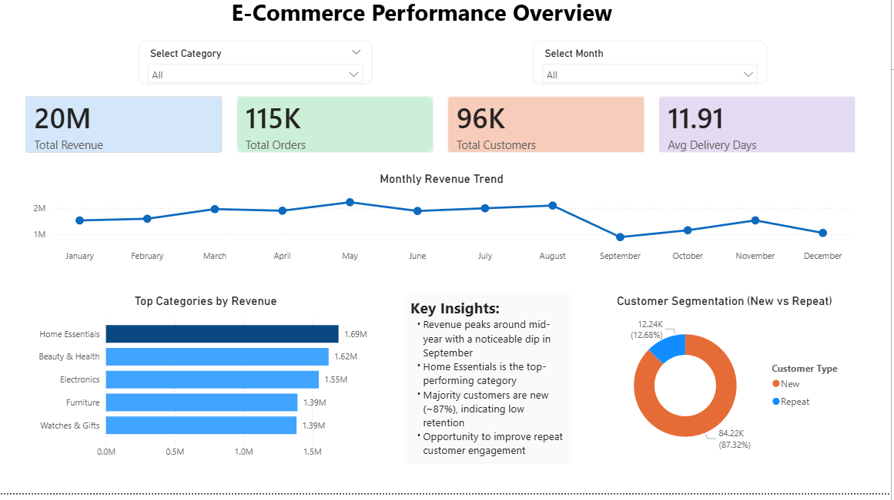

# 🛒 E-Commerce End-to-End Data Analytics

## 📌 Overview

This project focuses on analyzing an E-Commerce dataset to extract actionable insights using SQL, Python, and Power BI.

---

## 🎯 Business Problem

Businesses often struggle to understand:

* Which products drive the most revenue
* Which regions are profitable or loss-making
* How customer behavior impacts sales

This project solves these problems using data analysis.

---

## 🛠 Tools & Technologies

* SQL (Data Analysis)
* Python (Data Cleaning & Preprocessing)
* Power BI (Dashboard & Visualization)

---

## 🔄 Project Workflow

1. Data Cleaning using Python (handling missing values, formatting)
2. Data Analysis using SQL (KPIs, trends, segmentation)
3. Data Visualization using Power BI (interactive dashboard)

---

## 📈 Key Insights

* Top categories contribute a major portion of total sales
* Certain regions consistently generate losses
* Repeat customers have higher lifetime value
* Seasonal patterns significantly impact revenue

---

## 📊 Dashboard Preview

---

## ✅ Conclusion

This project demonstrates an end-to-end data analytics workflow, transforming raw data into meaningful insights and interactive dashboards for business decision-making.

---

## 🚀 Future Improvements

* Add predictive analytics (sales forecasting)
* Automate data pipeline
* Deploy dashboard online

