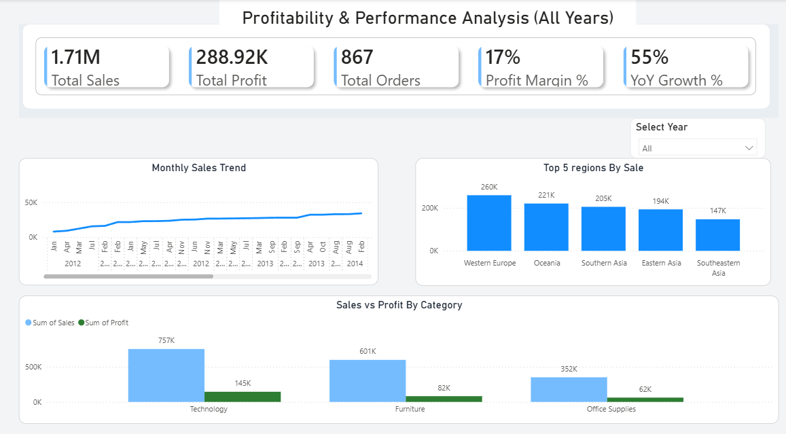
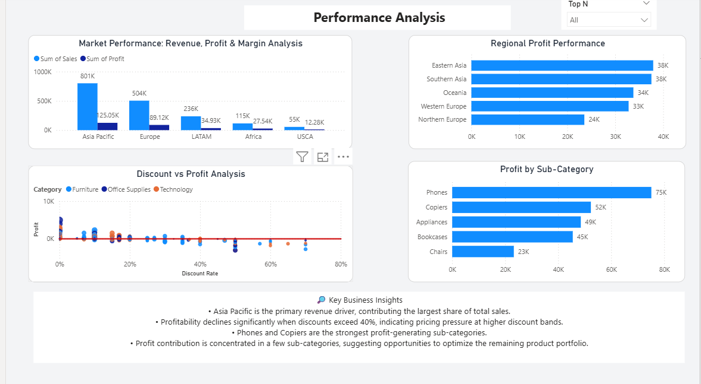
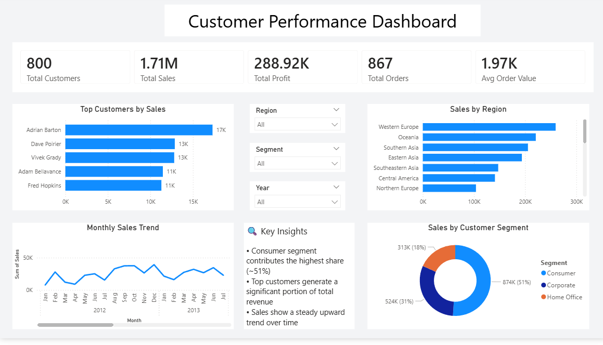

# Performance & Customer Analysis Dashboard (Power BI)

## Objective
To analyze sales, profit, and customer performance using an interactive multi-page dashboard.

---

## 📊 Page 1: Overall Performance
- Total Sales, Profit, Orders, and Profit Margin
- Monthly sales trend
- Region-wise contribution

---

## 📈 Page 2: Performance Analysis
- Market-wise revenue and profit analysis
- Discount vs profit relationship
- Top-performing sub-categories

---

## 👥 Page 3: Customer Analysis
- Top customers by sales
- Sales by region and segment
- Customer trends and insights

---

## 🛠 Tools Used
- Power BI

---

## 📌 Key Insights
- Asia Pacific is the highest revenue-generating region
- High discounts negatively impact profitability
- Consumer segment contributes the largest share of sales
- Sales show consistent growth over time
